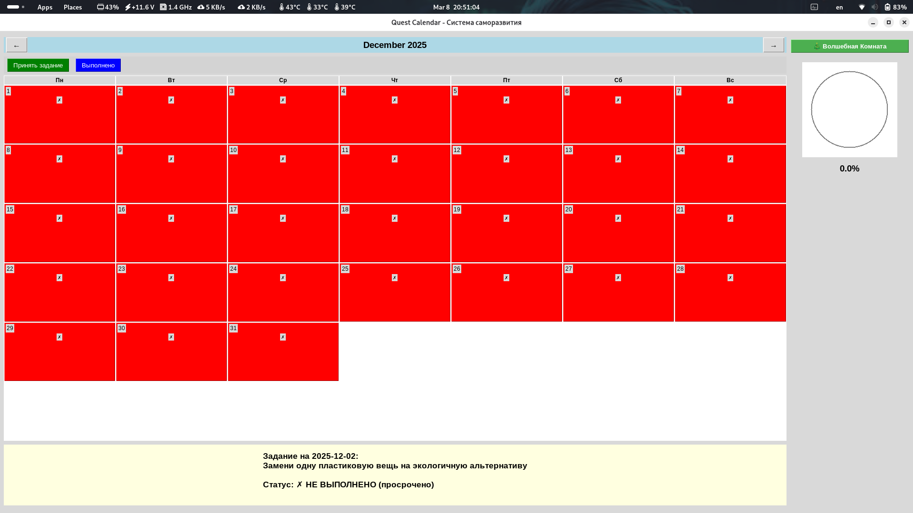
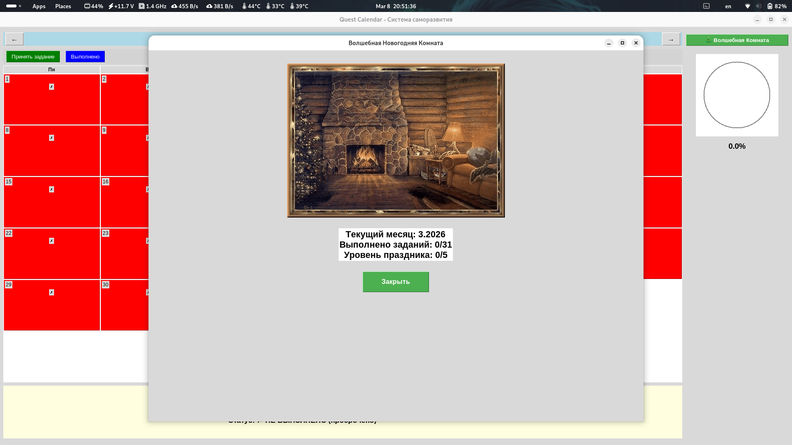

<div align="center">
  
# 🎯 Quest Calendar v1.0.0


> 🎮 Геймифицированная система саморазвития с ежедневными заданиями и новогодней темой  
> 📅 Календарь заданий • 🎁 Волшебная комната • ⏰ Таймеры • 📊 Прогресс

</div>

---

## 📋 Оглавление
- [📖 О проекте](#-о-проекте)
- [✨ Возможности](#-возможности)
- [📸 Демонстрация](#-демонстрация)
- [📥 Установка и запуск](#-установка-и-запуск)
- [🎮 Использование](#-использование)
- [🛠 Технологии](#-технологии)
- [🧱 Структура проекта](#-структура-проекта)
- [🔧 Решение проблем](#-решение-проблем)
- [📄 Лицензия](#-лицензия)
- [📬 Контакты](#-контакты)

---

## 📖 О проекте

**Quest Calendar** — это уникальное приложение для саморазвития, которое превращает ежедневные задачи в увлекательную игру с элементами геймификации и праздничной атмосферой.

> 🎯 **Основная идея:** Каждый день — новое задание. Каждое выполненное задание — шаг к награде и волшебству!

### 🔥 Ключевые особенности
- **📅 Ежедневные квесты** — 30+ уникальных заданий на каждый день
- **🎄 Волшебная комната** — праздничная анимация, которая улучшается с прогрессом
- **⏰ Таймер выполнения** — 24 часа на каждое задание с уведомлениями
- **📊 Визуальный прогресс** — круговой индикатор выполнения месяца
- **🎫 Система наград** — билеты и бонусы за достижение целей

---

## ✨ Возможности

| Фича | Описание |
|------|----------|
| 📅 **Ежедневные задания** | 30+ уникальных квестов: спорт, обучение, социализация, творчество |
| 🎄 **Волшебная комната** | Анимированная новогодняя сцена с ёлкой, камином и подарками |
| 🎁 **Система подарков** | Подарки появляются под ёлкой за выполненные задания |
| ⏰ **Таймер заданий** | 24 часа на выполнение с обратным отсчётом |
| 🔔 **Уведомления** | Напоминания о активных заданиях и дедлайнах |
| 📊 **Прогресс-трекинг** | Круговой индикатор выполнения месяца в процентах |
| 🎫 **Награды** | Билет на 10 баллов при 100% выполнении месяца |
| 📆 **Календарь** | Визуальное отображение выполненных/просроченных дней |
| 💾 **Автосохранение** | Все данные сохраняются в JSON между сессиями |

---

## 📸 Демонстрация

<div align="center">

| 📅 Главный экран | 🎄 Волшебная комната |
|:--------------:|:-------------------:|
|  |  |
| *Календарь с заданиями и прогрессом* | *Новогодняя сцена* |

</div>

---

## 📥 Установка и запуск

### ⚡ Быстрый старт

```bash
# 1. Клонируйте репозиторий
git clone https://github.com/Andrey3141/Quest-Calendar.git
cd Quest-Calendar

# 2. Установите зависимости
pip install -r requirements.txt

# 3. Запустите приложение
python main.py
```

### 📦 Требования
| Компонент | Версия | Назначение |
|-----------|--------|-----------|
| 🐍 Python | 3.8+ | Основной язык |
| 🪟 Tkinter | Встроен | Графический интерфейс |
| 🖼️ Pillow | 9.0+ | Обработка изображений (для GIF) |
| 🔔 Plyer | 2.1+ | Системные уведомления |

---

## 🎮 Использование

### 1️⃣ Первый запуск

1.  Запустите `python main.py`
2.  Приложение автоматически создаст файл `daily_quests.json` с заданиями на 30 дней
3.  Откроется главное окно с календарём

### 2️⃣ Работа с заданиями

| Действие | Как сделать |
|----------|------------|
| 📅 **Просмотреть задание** | Кликните на любой день в календаре |
| ✅ **Принять задание** | Нажмите «Принять задание» (только на сегодня) |
| 🏁 **Завершить задание** | Нажмите «Выполнено» после завершения |
| 📊 **Проверить прогресс** | Смотрите круговой индикатор справа |

### 3️⃣ Волшебная комната

1.  Нажмите кнопку **«🎄 Волшебная Комната»** в правой панели
2.  Количество подарков под ёлкой зависит от выполненных заданий:
    | Выполнено | Уровень | Подарков |
    |-----------|---------|----------|
    | 1-5 | 1 | 🎁 |
    | 6-10 | 2 | 🎁🎁 |
    | 11-15 | 3 | 🎁🎁🎁 |
    | 16-20 | 4 | 🎁🎁🎁🎁 |
    | 20+ | 5 | 🎁🎁🎁🎁🎁 |

### 4️⃣ Система наград

-   **100% выполнение месяца** → 🎫 Билет на 10 баллов по всем предметам
-   Кликните на круг прогресса, чтобы проверить доступные награды

---

## 🛠 Технологии

```
🐍 Python 3.8+     — основной язык
🪟 Tkinter         — графический интерфейс (встроен в Python)
🖼️ Pillow          — обработка изображений и GIF
🔔 Plyer           — кроссплатформенные уведомления
📅 Calendar        — работа с календарём и датами
💾 JSON            — хранение данных и прогресса
🧵 Threading       — фоновые таймеры и анимации
```

### 📊 Архитектура приложения

| Модуль | Роль |
|--------|------|
| 🟣 `QuestCalendar` | Главный класс: календарь, задания, прогресс |
| 🟢 `ChristmasScene` | Новогодняя сцена: анимация, подарки, камин |
| 🔵 `gif.py` | Утилита: создание GIF из изображений |

---

## 🧱 Структура проекта

```
Quest-Calendar/
├── 📄 main.py                 # Главное приложение
│   ├── QuestCalendar          # Класс календаря с заданиями
│   │   ├── load_quests()      # Загрузка/создание заданий
│   │   ├── create_widgets()   # Создание интерфейса
│   │   ├── update_calendar()  # Обновление календаря
│   │   ├── accept_quest()     # Принятие задания
│   │   ├── complete_quest()   # Завершение задания
│   │   ├── start_timer()      # Запуск таймера (24 часа)
│   │   ├── show_notification() # Системные уведомления
│   │   └── update_progress_circle() # Индикатор прогресса
│   │
│   └── ChristmasScene         # Новогодняя сцена
│       ├── draw_scene()       # Отрисовка комнаты
│       ├── draw_christmas_tree() # Ёлка с украшениями
│       ├── draw_fireplace()   # Камин с огнём
│       ├── draw_gifts()       # Подарки под ёлкой
│       ├── draw_digital_clock() # Электронные часы
│       ├── add_gift()         # Добавить подарок
│       └── update_clock()     # Обновление времени (каждую секунду)
│
├── 📄 gif.py                  # Утилита для создания GIF
│   ├── create_gif_from_images()  # GIF из папки с изображениями
│   ├── create_gif_with_custom_order() # GIF из конкретных файлов
│   ├── resize_images_for_gif()     # Изменение размера изображений
│   └── quick_create_gif()          # Быстрое создание из 3 фото
│
├── 📄 daily_quests.json       # Данные заданий (автогенерируется)
│   ├── date_str               # Дата в формате YYYY-MM-DD
│   ├── quest                  # Текст задания
│   ├── gift                   # Награда за выполнение
│   ├── start_date             # Время начала выполнения
│   ├── end_date               # Дедлайн (24 часа)
│   ├── completed              # Статус выполнения
│   └── success                # Успешно/неуспешно
│
├── 📁 screenshots/            # Скриншоты для README
├── 📁 1/                      # Изображения для GIF (опционально)
│   ├── 1.jpg
│   ├── 2.jpg
│   └── 3.jpg
└── 📄 requirements.txt        # Зависимости Python
```

---

## 🔧 Решение проблем

<details>
<summary>❌ Ошибка: «No module named PIL»</summary>

```bash
pip install Pillow
```
</details>

<details>
<summary>❌ Ошибка: «No module named plyer»</summary>

```bash
pip install plyer
```
</details>

<details>
<summary>❌ Уведомления не отображаются</summary>

1.  **Windows:** Проверьте «Параметры» → «Система» → «Уведомления»
2.  **Linux:** Установите `notify-osd` или аналогичный демон уведомлений
3.  **macOS:** Проверьте «Системные настройки» → «Уведомления»
</details>

<details>
<summary>❌ Волшебная комната не показывает изображения</summary>

1.  Убедитесь, что файлы `christmas_1.gif` — `christmas_5.gif` существуют в папке проекта
2.  Проверьте, что установлен `Pillow`: `pip install Pillow`
3.  Если изображений нет — комната покажет текстовую версию прогресса
</details>

<details>
<summary>❌ Задания не сохраняются после перезапуска</summary>

1.  Проверьте права на запись в папку с приложением
2.  Убедитесь, что файл `daily_quests.json` не открыт в другом редакторе
3.  Не удаляйте файл `daily_quests.json` — он хранит весь прогресс
</details>

<details>
<summary>❌ Таймер не работает</summary>

1.  Таймер работает в фоновом потоке — не закрывайте приложение
2.  Проверьте, что задание принято (кнопка «Принять задание» была нажата)
3.  Уведомления могут блокироваться антивирусом или системой
</details>

---

## 📅 Примеры заданий

Приложение генерирует 30 уникальных заданий автоматически:

| Категория | Примеры заданий |
|-----------|----------------|
| 🤝 **Социализация** | Познакомься с 3 новыми людьми, Возьми 5 номеров, Сделай комплимент |
| 📚 **Обучение** | Выучи 20 иностранных слов, Прочитай научную статью, Реши 10 задач |
| 💪 **Спорт** | Сделай 100 отжиманий, Пробеги 5 км, Сходи в тренажёрный зал |
| 🎨 **Творчество** | Напиши стихотворение, Нарисуй картину, Создай музыку |
| 🧘 **Здоровье** | Выпей 2 литра воды, Спи 8 часов, Медитация 15 минут |
| 🤲 **Помощь** | Помоги незнакомцу, Сделай доброе дело, Позвони родственнику |

---

## 🤝 Вклад в проект

Приветствуются PR и Issues! 🙌

1.  Форкните репозиторий
2.  Создайте ветку: `git checkout -b feature/your-feature`
3.  Закоммитьте изменения: `git commit -m 'feat: add your feature'`
4.  Отправьте: `git push origin feature/your-feature`
5.  Откройте Pull Request

📖 Подробнее: [CONTRIBUTING.md](CONTRIBUTING.md) *(скоро)*

---

## 📄 Лицензия

<div align="center">

[](LICENSE)

Проект распространяется под лицензией **MIT**.  
См. файл [LICENSE](LICENSE) для подробностей.

</div>

---

<div align="center">

## 📬 Контакты и поддержка

> 💬 Есть вопрос, идея или нашли баг? Пишите!

[](https://github.com/Andrey3141)
[](https://t.me/tools271)
[](mailto:askachkov08@gmail.com)

</div>

---

<div align="center">

### 🙏 Благодарности

- **Python Community** за отличный язык и библиотеки 🐍
- **Tkinter** за простой и надёжный GUI 🪟
- **Pillow Team** за обработку изображений 🖼️
- **МГТК** за мотивацию к разработке 🎓

---

**Quest Calendar** — преврати каждый день в приключение! 🎮📅

*Сделано с ❤️ на Python + Tkinter*

</div>
